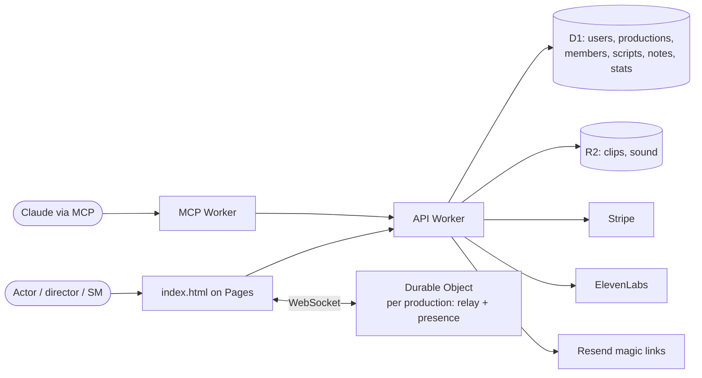

# Architecture — Tablework (transcriptor)

Today (2026-09-30): one static file, no server. Target: the same frontend
plus a Cloudflare edge backend (ADR 002). This file describes both; the
"Target" parts are not built yet and `next_up.md` tracks them.

## Shape

## Layout (today)

| Path | Role |
|---|---|
| `index.html` | The whole frontend: markup, styles, script |
| `sentences.js` | Sentence/piece splitter, shared by browser and `convert.py` tests |
| `script.js`, `clips.js`, `clips/` | Generated for this show; move to D1/R2 in target |
| `cues.js`, `sound/` | This show's sound design; becomes per-production upload |
| `convert.py`, `tts.py`, `normalize.py`, `stress.json` | Pipeline for this show; `tts.py` becomes a Worker job |
| `sw.js` | Service worker; `CACHE` bumped every deploy |
| `api/` | The Workers backend: `src/index.ts` entry (handler only), `src/router.ts`, `src/routes/*.ts` (one file per area), `src/auth.ts`, `src/access.ts`, `src/email.ts`, `migrations/` D1, `test/` vitest on a real D1 |
| `api/src/mcp.ts`, `api/src/routes/mcp*.ts`, `routes/scripts.ts` | The MCP server (`POST /mcp`, bearer personal tokens) and its tools: whoami, list_productions, list_members, set_parts, invite, add_script, get_script |
| `Taskfile.yml` | `task serve` (app), `task dev` (API on :8787), `task test` (gate), `task deploy` (Lee) |
| `docs/BEHAVIOUR.md` | Exact behaviour of the app as it stands |

## Data flow

Today: everything in `localStorage` (script, place, role, stats, notes,
sound prefs). Leader/follower over public MQTT (see BEHAVIOUR "Together").

Target: the browser keeps `localStorage` as a cache and works with no
account (try-it path). Signed in, state syncs to D1 through the API Worker.
A production owns scripts, cues, sound files, members and the clip render
budget. Notes are private per member unless shared to the production.
Together goes through the production's Durable Object, one WebSocket per
device; the DO orders moves by its own clock and keeps the last move for
late joiners. Clips are looked up by `sha1(model + voice + text)` in R2
before any render is bought.

## Hosting and deploy

- Today: GitHub Pages from `main`; push = deploy; bump `sw.js` CACHE.
- Target: Cloudflare Pages (frontend) + `wrangler deploy` (Workers, D1
  migrations, DO). Deploys are `ACTION:` items for Lee until a CI path is
  recorded here.
- Environments: `task dev` runs the Worker on :8787 with a local D1 and no
  login; prod needs `wrangler login` and a D1 id in `api/wrangler.toml`.

## Scenarios

| Scenario | What happens | Where handled |
|---|---|---|
| Try before signup | Paste a script, browser voices, no account; state in localStorage until signup, then uploaded | frontend |
| Same play rendered by a second production | Every clip already in R2 by hash; price shown is $0 | API render endpoint |
| ElevenLabs down mid-render | Render job is per line and resumable; lines done stay done; user sees progress and a retry | render Worker |
| Leader loses connection | DO keeps last move; follower reconnects and lands right; header says "no leader for 45 s" | DO + frontend |
| Member removed from production | Session still valid, membership check on every production route returns 403; local cache of that script cleared on next load | API middleware |
| Owner stops paying | Production goes read-only after grace; nothing deleted; export stays | Stripe webhook → production.state |
| Copyrighted script uploaded | Private to the production, never listed or shared beyond members; takedown path in TOS | policy, not code |

## External services

| Service | Used for | Parser / adapter |
|---|---|---|
| ElevenLabs | Voice render | `voices/eleven.ts` → generic `Clip` |
| Stripe | Checkout, portal, webhooks | `billing/stripe.ts` → `Subscription` |
| Resend | Magic-link email | `auth/mail.ts` |
| Cloudflare D1/R2/DO/KV | Store, files, relay, sessions | direct |
